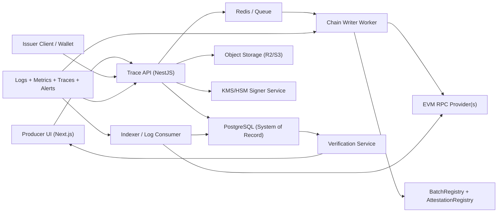

# TerroirOS Trace: Production Architecture Requirements

## 1. Outcome and Scope

This document defines what is required to move TerroirOS Trace from MVP mode
to a production-grade blockchain provenance platform with a high-confidence
producer dashboard.

Target outcomes:

- verifiable event integrity from producer action to on-chain anchor
- resilient data architecture with strong auditability and recovery
- operationally safe multi-tenant infrastructure for producers/issuers
- measurable reliability and security controls for enterprise adoption

## 2. Producer Dashboard Redesign Requirements

The dashboard should operate as a trust operations console, not just a batch
list.

Must-have product behaviors:

- real-time KPIs for trace throughput, chain confirmation coverage, issuer trust
  ratio, and verification-ready batches
- lifecycle coverage view for every required trace step (`BATCH_CREATED`,
  `HARVEST_RECORDED`, `PROCESSING_RECORDED`, `BOTTLING_RECORDED`,
  `SHIPMENT_RECORDED`)
- per-batch integrity score derived from signature checks, hash continuity,
  lifecycle completion, and trusted issuer membership
- risk queue showing high-priority actions (missing steps, unanchored events,
  failed transactions, low-trust issuer participation)
- chain telemetry panel (`QUEUED`, `SUBMITTED`, `CONFIRMED`, `FAILED`) with
  backlog visibility

## 3. Reference System Architecture

## 4. Blockchain Layer Requirements

### 4.1 Network and Contracts

- use an EVM-compatible L2 with predictable fees and stable finality
- maintain one primary network and one secondary failover network
- pin deployed contract addresses by environment (`dev`, `staging`, `prod`)
- enforce deterministic `eventId` uniqueness and replay protection
- support contract upgrade strategy (`UUPS`/proxy or immutable + versioned
  registries with migration playbook)

### 4.2 Transaction Pipeline

- write chain jobs through an idempotent queue (at-least-once delivery)
- include nonce management and replacement transaction strategy
- classify failure types (`rpc_error`, `revert`, `insufficient_funds`,
  `underpriced`, `timeout`) for operator remediation
- persist full tx lifecycle: created, submitted, mined, confirmed, failed
- verify emitted on-chain events against expected event hash before marking
  `CONFIRMED`

### 4.3 Key Management

- do not store private keys in app configuration or code
- use managed KMS/HSM-backed signing for issuer and relayer keys
- enforce key rotation policy and emergency key-revoke runbook
- sign all critical control-plane actions with auditable service identity

## 5. Database and Storage Requirements

### 5.1 Primary Database (PostgreSQL)

PostgreSQL must replace in-memory maps as the source of truth for:

- producers
- batches
- issuers
- batch_events
- chain_transactions
- external_events
- audit_log

Schema requirements:

- keep foreign-key constraints for producer, batch, and issuer integrity
- add unique constraints on natural IDs (`producer_id`, `batch_id`, `event_id`)
- index hot paths:
  - `batch_events(batch_id, event_timestamp desc)`
  - `batch_events(issuer_id, event_timestamp desc)`
  - `chain_transactions(status, updated_at desc)`
  - `chain_transactions(event_id)`
- add `created_at`/`updated_at` columns to every mutable table
- add soft-delete policy only where legally necessary (default: immutable
  records for trace events)

Connection requirements:

- TLS required for all DB traffic in non-local environments
- pooler required (`pgBouncer` recommended)
- migration gate in CI/CD (deploy blocked if migration check fails)
- automated backups with:
  - point-in-time recovery enabled
  - daily restore validation in staging
  - RPO <= 15 minutes, RTO <= 60 minutes

### 5.2 Queue and Cache

- Redis (or equivalent) for chain job queue and short-lived caching
- queue jobs must include dedupe key (`event_id`) and retry budget
- dead-letter queue required for repeated failures
- cache TTL boundaries documented and enforced (no unbounded cache growth)

### 5.3 Evidence/Object Storage

- use object storage (Cloudflare R2 or S3 compatible) for documents and media
- store only URI + content hash + metadata in PostgreSQL
- enforce immutable object versions for compliance-sensitive artifacts
- require presigned upload/download flows and bucket-level access policies

## 6. API and Data Flow Requirements

### 6.1 API Contracts

- all write endpoints must be idempotent via request ID or entity ID
- schema validation required on every ingress payload
- signature verification is mandatory before event persistence
- event authorization matrix enforced per issuer role
- provide pagination + filtering for producer and auditor workloads

### 6.2 Transactional Consistency

- persist event + outbox record in one DB transaction
- asynchronous chain submission must consume outbox entries
- state transitions must be monotonic (`QUEUED -> SUBMITTED -> CONFIRMED/FAILED`)
- never mark verification complete on cache-only state

## 7. Security, Compliance, and Governance

- role-based access control for producer operators, issuer admins, auditors,
  and platform ops
- multi-factor authentication for control-plane users
- full audit trail for:
  - role changes
  - issuer trust flag changes
  - contract/config updates
- encryption at rest for DB and object storage
- data retention policy for PII and commercial records by jurisdiction
- periodic third-party security review and smart contract audit

## 8. Observability and Reliability Requirements

Required telemetry:

- distributed tracing (`api -> queue -> chain worker -> indexer`)
- structured logs with correlation IDs
- metrics:
  - event ingest latency p95
  - tx confirmation latency p95
  - queue depth
  - verification error rate
  - RPC provider error rate

SLO targets:

- API availability >= 99.9%
- event ingest success >= 99.95%
- chain submission success >= 99.5% (excluding chain-wide incidents)
- verification endpoint p95 latency <= 500ms (cached) / <= 1500ms (cold)

## 9. Environment and Integration Checklist

Required environment configuration:

- `DATABASE_URL` (PostgreSQL, TLS enabled in non-local)
- `DATABASE_READ_URL` (optional read replica)
- `REDIS_URL`
- `OBJECT_STORAGE_ENDPOINT`
- `OBJECT_STORAGE_BUCKET`
- `OBJECT_STORAGE_ACCESS_KEY`
- `OBJECT_STORAGE_SECRET_KEY`
- `EVM_RPC_PRIMARY_URL`
- `EVM_RPC_SECONDARY_URL`
- `CHAIN_ID`
- `BATCH_REGISTRY_ADDRESS`
- `ATTESTATION_REGISTRY_ADDRESS`
- `KMS_KEY_ID` or signer reference
- `JWT_PUBLIC_KEY` / auth provider settings
- `OTEL_EXPORTER_OTLP_ENDPOINT`

## 10. Delivery Phases

1. Foundation:
   - move API modules to persistent repositories (PostgreSQL)
   - add migrations + seeds + CI migration checks
   - introduce queue-backed chain worker
2. Trust hardening:
   - KMS signing, replay protection, deterministic event/outbox pipeline
   - indexer reconciliation and mismatch alerting
3. Scale and governance:
   - read replicas, dashboard analytics views, audit logging, RBAC expansion
   - SLO-driven alerting and runbook automation
4. Certification readiness:
   - external security audit, contract audit, disaster-recovery rehearsal
   - compliance evidence package for enterprise procurement
